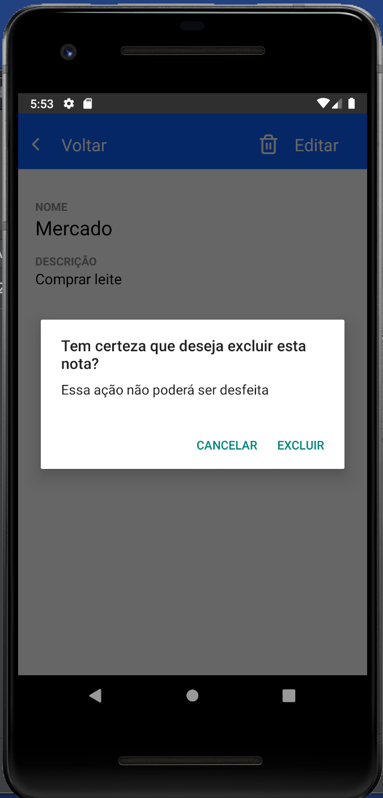

# Notes App

## Sobre

Após o treinamento de React Native que tivemos na IBM, foi nos passado para desenvolver um aplicativo de notas, onde utilizei React Navigation e Async Storage, o app ainda esta em andamento.

## Realizado até o momento

- Tela sem notas criadas

- Tela de criação de notas

- Tela com todas as notas já criadas

- Tela de visualização de nota

- Opção de excluir nota

---

